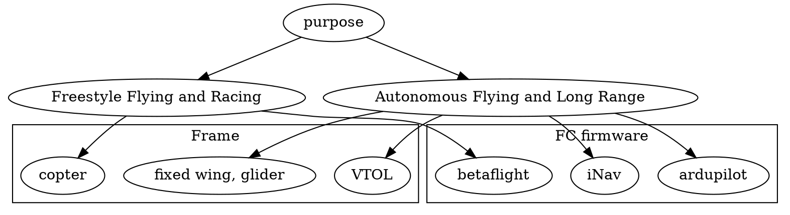
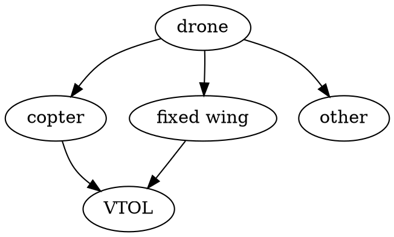

# drone

## Roadmap

## Frame types

https://docs.px4.io/master/en/airframes/airframe_reference.html#plane
https://ardupilot.org/copter/docs/frame-type-configuration.html

**VTOL** - Vertical Take-Off and Landing
**FPV** https://ardupilot.org/plane/docs/fpv-plane.html

Params/features:

- low speed (stall speed)
- high speed
- resistance in case of crash
- acrobatics
- (compartment) is it enough space for flight controller etc?
- can it be dissabled for transportation?

https://www.youtube.com/watch?v=voHJ-VDGi4I

## Features

- Model remote controled (RC) airplane
  - Think of hobby airplane models controlled with RC before drone become a thing
  - Uses stabiliser
  - Often frames are build from styrofoam
- First Person View (FPV)
  - Next step you have the same RC, but as well you can see objects as if you are pilot on the drone. So drone can be manipulated even if it's out of sight
  - Uses flight controller
  - On Screen Display (OSD) - overlays technical info over FPV video
  - Inertial measurement unit (IMU)
  - Racing or acrobatics vs long range drones
- Autonomous drones
  - Those doesn't need pilot instead they are manipulated by flight computer and missin control software
  - Uses flight controller and flight computer

## Parts

- Frame
- [Flight controller (FC)](https://fusion.engineering/flight-controllers-explained-for-everyone/)
- GPS Module
- Electronic Speed Controllers (ESC)
- Battery
- Power Distribution Boards (PDB)
- Motor(s)
- Propeller(s)
- Servos
- Reciever (RX)
- Joystick/Controller
- Video Transmiter (VTX)
- FPV Anthena
- FPV Camera
- Video Receivers
- FPV Goggles

## Open source drone or DIY drone

### 3D print frame

See http://rc-plans.com/catalog/1004

Paid options:

- https://3dlabprint.com/product-category/3dlabgang/
- https://www.eclipson-airplanes.com/
- https://www.planeprint.com/
- https://www.rc3dprint.com/planes

### Flight controller

- Pixhawk
- Matek https://inavfixedwinggroup.com/shopping-list/flight-controllers/
- https://www.researchgate.net/publication/325134452_A_Survey_of_Open-Source_UAV_Flight_Controllers_and_Flight_Simulators
  - https://www.connectedpapers.com/
- ? https://github.com/satshakit/satshakit-flight-controller
- ? https://cribstone.github.io/humblehacker/2015/08/28/A-DIY-Flight-Controller.html

### Flight controller firmware

- Freestyle Flying and Racing
  - [Betaflight](https://github.com/betaflight/betaflight)
  - [Emuflight](https://github.com/emuflight/EmuFlight)
  - [KISS](http://kiss.flyduino.net/downloads/)
  - [FlightOne FalcoX](https://shop.flightone.com/product/falcox-fc-license/)
- Autonomous Flying
  - [iNav](https://github.com/iNavFlight/inav)
  - [Ardupilot](https://github.com/ArduPilot/ardupilot)
- Honorable Mentions
  - [Multiwii](http://www.multiwii.com/)
  - [Baseflight](https://github.com/multiwii/baseflight)
  - [Cleanflight](http://cleanflight.com/)
  - [Butterflight](https://github.com/ButterFlight/butterflight)
  - [OpenPilot](https://github.com/commaai/openpilot)
  - [LibrePilot](https://github.com/librepilot/LibrePilot)
  - [TauLabs](https://github.com/TauLabs/TauLabs)
  - [dRonin](https://dronin.org/)

[source](https://oscarliang.com/mini-quad-fc-firmware/)

[Firmwares for Flight Controllers, Matek](http://www.mateksys.com/?p=5159)

## Examples of flying wing setups

- https://www.fpv24.com/en/fpv-nurfluegler
- https://inavfixedwinggroup.com/category/recommended-setups/long-range-setups/
- https://www.fpvknowitall.com/ultimate-fpv-shopping-list/
- https://ardupilot.org/plane/docs/miniTalon-build.html

## Controller

aka Transmitter, Radio Transmitter, Radio

- [Introduction](https://www.youtube.com/watch?v=SrN6ps4NM10)
- https://www.open-tx.org/radios.html

Example:

- [Eachine TX16S](https://www.banggood.com/Eachine-TX16S-Hall-Sensor-Gimbals-2_4GHz-16CH-Internal-Multi-protocol-RF-System-OpenTX-Radio-Transmitter-for-RC-Drone-p-1837632.html?p=CS101558118042016088&utm_campaign=mesh&utm_content=tanghao&cur_warehouse=CN)

> - [UHF RC](https://www.youtube.com/watch?v=anLwhavmA1k) (433MHz)
> - TBS Crossfire (868MHz/915MHz)
> - ExpressLRS / ELRS (2.4GHz and 868MHz/915MHz)
> - TBS Tracer (2.4GHz)
> - Immersion Ghost (2.4GHz)
> - FrSky (2.4GHz)
>
> -- https://oscarliang.com/radio-transmitter/

TBS - team blacksheep
LRS - long range systems

https://github.com/openLRSng
