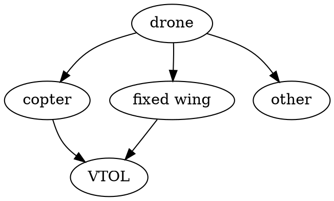

# drone

## Frame types

VTOL - Vertical Take-Off and Landing
FPV https://ardupilot.org/plane/docs/fpv-plane.html

## Features

- Model remote controled (RC) airplane
  - Think of hobby airplane models controlled with RC before drone become a thing
  - Uses stabiliser
  - Often frames are build from styrofoam
- First Person View (FPV)
  - Next step you have the same RC, but as well you can see objects as if you are pilot on the drone. So drone can be manipulated even if it's out of sight
  - Uses flight controller
  - On Screen Display (OSD) - overlays technical info over FPV video
  - Inertial measurement unit (IMU)
  - Racing or acrobatics vs long range drones
- Autonomous drones
  - Those doesn't need pilot instead they are manipulated by flight computer and missin control software
  - Uses flight controller and flight computer

## Parts

- Frame
- [Flight controller (FC)](https://fusion.engineering/flight-controllers-explained-for-everyone/)
- GPS Module
- Electronic Speed Controllers (ESC)
- Battery
- Power Distribution Boards (PDB)
- Motor
- Propellers
- Servos
- Reciever (RX)
- Joysticks
- Video Transmiter (VTX)
- FPV Anthena
- FPV Camera
- Video Receivers
- FPV Goggles

## Open source drone or DIY drone

### 3D print frame

See http://rc-plans.com/catalog/1004

Paid options:

- https://3dlabprint.com/product-category/3dlabgang/
- https://www.eclipson-airplanes.com/
- https://www.planeprint.com/
- https://www.rc3dprint.com/planes

### Flight controller

- Pixhawk
- Matek https://inavfixedwinggroup.com/shopping-list/flight-controllers/
- https://www.researchgate.net/publication/325134452_A_Survey_of_Open-Source_UAV_Flight_Controllers_and_Flight_Simulators
  - https://www.connectedpapers.com/
- ? https://github.com/satshakit/satshakit-flight-controller
- ? https://cribstone.github.io/humblehacker/2015/08/28/A-DIY-Flight-Controller.html

### Flight controller firmware

- Betaflight - for racing
- Ardupilot - for missions and long range
- iNav - for missions and long range
- ? https://reefwing.medium.com/a-review-of-open-source-flight-control-systems-2fe37239c9b6
= ? https://blog.dronetrest.com/flight-controller-firmware/

## Blogs

- CNC Kitchen [HOW TO 3D PRINT your own RC AIRPLANE](https://www.youtube.com/watch?v=Ztygn--BsjI&list=PLEOQTmIWJ_rnHDVqxPP-GQNJ1UcQ-eF2q&index=7)
- [René Rosentraeger](https://www.youtube.com/channel/UCj6O_mJ5G0JiGLTJUemIO_A), builds harrier
- https://www.youtube.com/c/TroyMcMillan/playlists
- https://www.youtube.com/c/JoelMelanieVlashof/playlists
- https://www.youtube.com/c/Painless360/playlists

## Solar RC

- https://www.youtube.com/watch?v=nk2-mRIhF0Q
- https://discuss.ardupilot.org/t/solar-rc-plane-300km-7h/60981
- https://www.ijmer.com/papers/Vol3_Issue2/AZ32752758.pdf

## Examples of flying wing setups

- https://www.fpv24.com/en/fpv-nurfluegler
- https://inavfixedwinggroup.com/category/recommended-setups/long-range-setups/
- https://www.fpvknowitall.com/ultimate-fpv-shopping-list/

## Antenna Tracker

- [DIY Simple RSSI Antenna Tracker using Arduino for less than $50!](https://www.youtube.com/watch?v=GGtqUXKE-ro)
