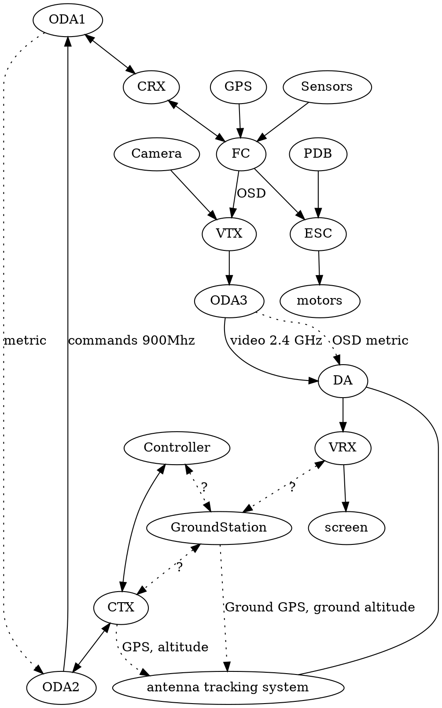

CRX - controller reciever (TBS CRSF, ESLR, UHF)
ODA - Omnidirectional antenna
metrics - GPS, RSSI, voltage etc. https://oscarliang.com/best-osd-quadcopter-fpv-data-on-screen-display-video
GCS - [Ground Control Stations](https://ardupilot.org/plane/docs/common-choosing-a-ground-station.html)

