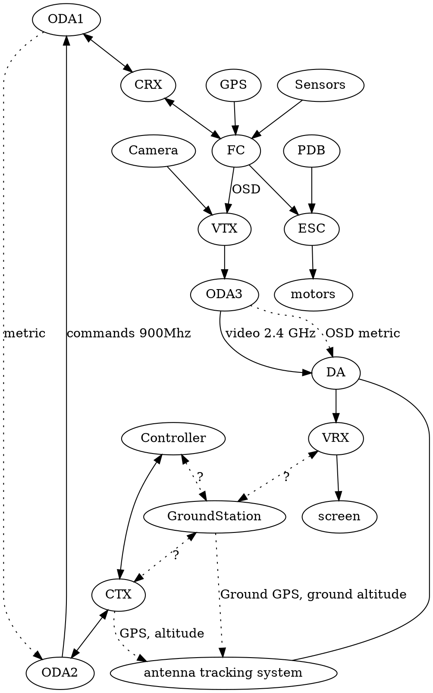
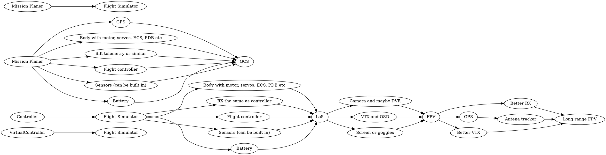

CRX - controller reciever (TBS CRSF, ESLR, UHF)
ODA - Omnidirectional antenna
metrics - GPS, RSSI, voltage etc. https://oscarliang.com/best-osd-quadcopter-fpv-data-on-screen-display-video
GCS - [Ground Control Stations](https://ardupilot.org/plane/docs/common-choosing-a-ground-station.html)

https://drones.stackexchange.com/questions/1855/is-it-possible-to-use-the-head-tracking-in-a-fpv-goggle-with-a-computer

|                              | LoS                | FPV                              | GCS                      |
| ---------------------------- | ------------------ | -------------------------------- | ------------------------ |
| Flight controller            | required (simpler) | required                         | required (more advanced) |
| Telemetry                    | required           | required, OSD                    | required, GPS            |
| Body                         | required           | required                         | required                 |
| TX                           | any                | ExpressLRS, Crossfire, etc       | SiK telemetry, RFD 900   |
| Control hardware             | Controller         | Controller + Screen or Goggles   | Laptop, phone, tablet    |
| Control software             | OpenTX, EdgeTX     | OpenTX, EdgeTX                   | Mission Planner etc.     |
| VTX                          |                    | required, WiFi broadcasting, etc |                          |
| Camera                       |                    | required, DVR, etc               |                          |
| Antenna tracker, gain antena |                    | optional                         |                          |
| GPS                          |                    | required for a. tracker          | required                 |

|       | ←maneuverability |                                    | long range→            |
| ----- | ---------------- | ---------------------------------- | ---------------------- |
| body  | multicopter      | VTOL                               | Fixed wing             |
| radio | WiFi, 2.4, 5.6   | Crossfire 900, ExpressLRS 900, 433 | SiK Telemetry 900, 433 |

Roadmap

- Determine path to upgrade. So I can start minimal, but upgrade later if I want to
- Determine how all parts would interact in the end

Simplest LoS https://www.youtube.com/watch?v=4ghxT9Di0Ag
Simplest FPV https://www.youtube.com/watch?v=2FUDB2lHfMc

|                    | RX  | Stabilizer | Stabilizer with GPS | Flight controller |
| ------------------ | --- | ---------- | ------------------- | ----------------- |
| Manual             | +   | +          | +                   | +                 |
| Stabilization      |     | +          | +                   | +                 |
| Return to home     |     |            | +                   | +                 |
| Mission (Waypoint) |     |            |                     | +                 |
| Telemetry          | ?   | ?          | ?                   | +                 |
| OSD                | ?   | ?          | ?                   | ?                 |
| DVR                |     |            |                     | ?                 |
| Needs controller   | +   | +          | +                   |                   |
| OS firmware        | +   |            |                     | +                 |
